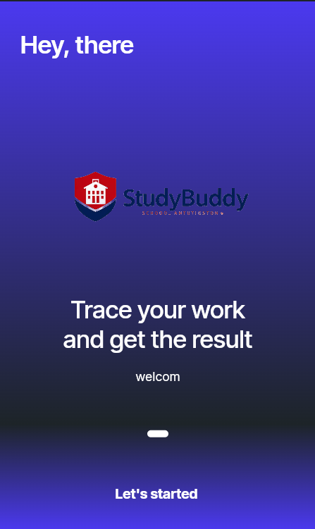
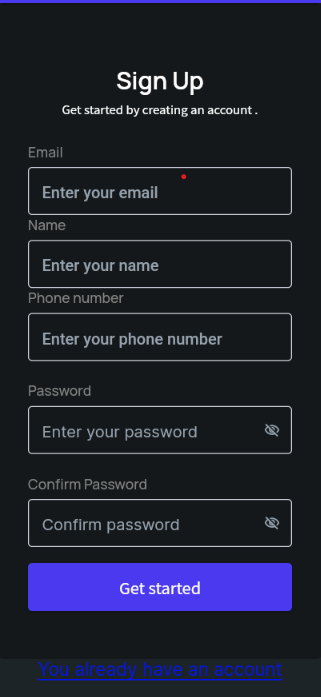
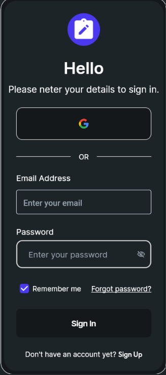
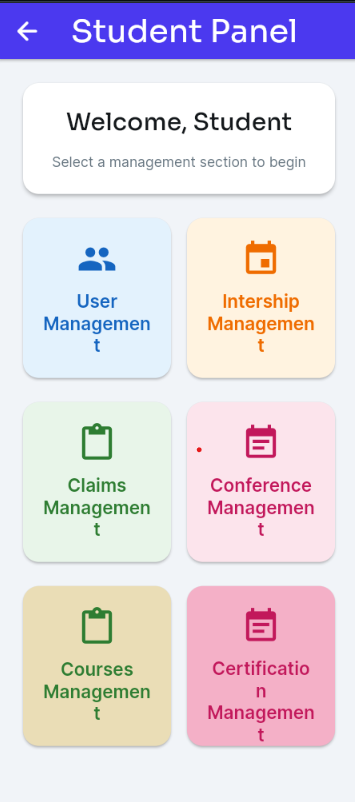
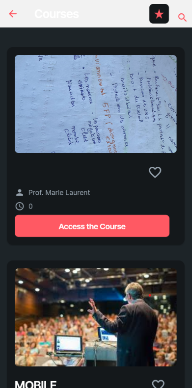

# 🎓 StudyBuddy

### School Management Companion App

A mobile app built to centralize student life — internships, claims, conferences, courses, and certifications — in one place.

  
  
  

  
  

> **Author:** Souibgui Mohamed Amine — Academic Project, ESPRIT

---

## 📋 Overview

StudyBuddy is a school management companion app designed to give students a single place to track and manage their academic life — from onboarding and authentication to internships, courses, claims, conferences, and certifications.

Built visually with **FlutterFlow** and backed by **Firebase** for authentication and data storage.

---

## ✨ Features

- 🔐 **Authentication** — Email/password sign up & sign in, plus Google Sign-In
- 👥 **User Management** — Manage student profiles and accounts
- 💼 **Internship Management** — Track and manage internship opportunities
- 📋 **Claims Management** — Submit and follow up on student claims
- 🎤 **Conference Management** — Browse and manage academic conferences/events
- 📚 **Courses Management** — Access courses, materials, and track progress
- 🏅 **Certification Management** — Manage earned and pending certifications

---

## 📱 Screenshots

<table>
<tr>
<td align="center" width="20%">
 
<b>Onboarding</b>
</td>
<td align="center" width="20%">
 
<b>Sign Up</b>
</td>
<td align="center" width="20%">
 
<b>Sign In</b>
</td>
<td align="center" width="20%">
 
<b>Student Panel</b>
</td>
<td align="center" width="20%">
 
<b>Courses</b>
</td>
</tr>
</table>

---

## 🛠️ Tech Stack

| Layer | Technology |
|:------|:-----------|
| App Builder | **FlutterFlow** (visual Flutter development) |
| Framework | **Flutter** (Dart) |
| Backend / Auth / DB | **Firebase** (Authentication, Firestore) |
| Auth Providers | Email/Password, Google Sign-In |
| Platforms | iOS, Android, Web |

---

## 📝 Notes

This project was built as an academic project at **ESPRIT**, using FlutterFlow's visual development environment to design and prototype a full school management experience without writing the UI layer by hand — with Firebase handling authentication and data persistence behind the scenes.

---

*StudyBuddy — Academic Project, ESPRIT — 2026*

